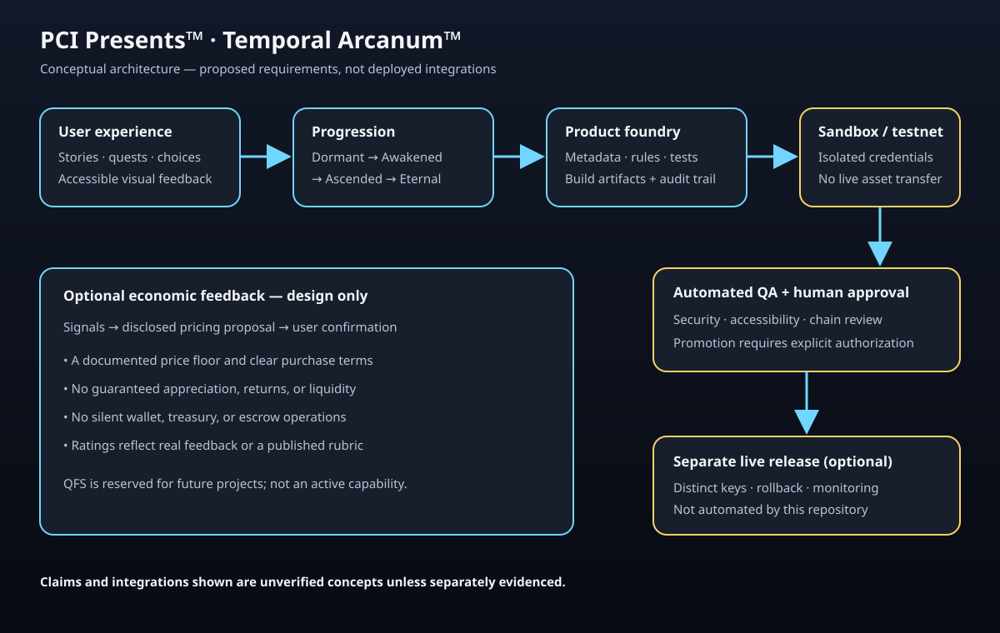

# PCI Presents™ — Temporal Arcanum™ Deployment Blueprint

**Status:** Concept and requirements captured from supplied material. This document does not assert that these systems are implemented, deployed, audited, or commercially available.

## Master Foundry and Auto-Portfolio standards

The supplied master standard labels these components “Active.” In this repository, that label is treated as the intended product requirement, not evidence of an operational feature. The following capabilities remain proposed:

| Component | Proposed standard | Implementation status here |
| --- | --- | --- |
| Prometheus AI orchestration | Coordinate portfolio presets, collectible progression, treasury signals, and market inputs. | Not implemented or verified |
| Auto-Portfolio presets | Present configurable wallet, staking, collectible, and treasury-flow views across supported networks. | Not implemented; no assets may move without explicit user authorization |
| Behavioral engagement | Use transparent, user-controlled rewards and participation feedback. | Not implemented; avoid manipulative retention or status pressure |
| Escrow and capital assurance | Define reviewed contract locks, milestone releases, and multisignature controls. | Not implemented or audited |
| Ticker spinner motif | Show accurate, accessible liquidity or treasury activity when connected to verified data. | Visual concept only; no live data integration |
| AAA+++ multimedia | Plan 3D, pulse, shimmer, contraption, environment, and story assets. | No complete asset suite is verified |
| Past/Present/Future Arcanum™ IP | Apply the setting and related names consistently in proposed product materials. | Ownership, registration, and legal protection claims are not verified here |
| Professor Chronos™ | Define a guide character for proposed story and product experiences. | Character concept only; animation and IP protection are not verified |
| Story/game mechanics | Support CYOA paths, hidden-object quests, and optional popular missions. | Requirements only; gameplay is not implemented |
| Foundry pipeline | Specify build, metadata-integrity, automated-QA, evolution-trigger, and staged-deployment gates. | Requirements only; automated deployment and NFT evolution are not implemented |

## Purpose

This blueprint organizes the supplied PCI Presents™ and Temporal Arcanum™ ideas into a staged product architecture. The intended experience combines action-driven product interactions, story/game mechanics, visual motifs, and optional digital-asset evolution. Any implementation should prioritize informed user choice, accessibility, security, and verifiable claims over engagement or financial outcomes.

## Proposed product standards

- **Identity and presentation:** PCI Presents™ branding, Aristo-Grin Seal™ motif, ticker/spinner, pulse, and siren-style visual feedback. Motion and sound should be optional, respect reduced-motion settings, and never imply urgency or a financial event that did not occur.
- **Story and participation:** Past/Present/Future Arcanum™ setting, Professor Chronos™ guide, choose-your-own-adventure paths, hidden-object activities, and seasonal/popular quests.
- **Progression:** Proposed collectible states are Dormant → Awakened → Ascended → Eternal. “Future-QFS” is reserved for future projects and is not an active tier, capability, or integration.
- **Ratings:** Ratings must reflect user feedback or a defined, auditable rubric. A universal hardcoded 5.0-star rating is not a verified user rating and must not be presented as one.
- **Foundry and QA:** Product metadata, scripts, accessibility, action triggers, pricing rules, and environment-specific configuration should pass automated checks before release.
- **Multi-environment release:** Develop and test in an isolated testnet/sandbox. A promotion to mainnet, when appropriate, requires explicit approval, security review, chain-specific tests, migration checks, and a rollback plan. Mainnet promotion must never happen automatically solely because a testnet run passed.
- **Portfolio presets:** Any preset should be informational and configurable by the user; it must not silently consolidate wallets, move assets, stake funds, or imply personalized investment advice.

## Environment flow

```text
Design and build
      ↓
Isolated sandbox / testnet
      ↓
Automated QA + accessibility + security checks
      ↓
Human approval + chain-specific deployment review
      ↓
Explicitly authorized live deployment (if implemented)
      ↓
Monitoring, incident response, and rollback
```

Testnet assets, keys, state, or scripts are not automatically portable to mainnet. Mainnet is a separate deployment target with separate credentials, configuration, approvals, and risk controls. The repository currently contains no system that deploys assets or contracts to either environment.

## Proposed interaction and financial boundaries

```text
User action → Mission / story response → Progress record → Optional visual feedback
                                          │
                                          └→ QA and audit trail

Market / treasury signals → validated inputs → disclosed pricing proposal → user confirmation
```

The loop above is a design outline, not an active Prometheus AI or treasury integration. Do not use behavioral engagement to exploit users or create artificial urgency. Rewards, if introduced, need transparent eligibility, funding, terms, and independent review.

Dynamic pricing must use disclosed inputs, enforce an actual documented minimum price, show the price and rules before purchase, and require user confirmation. Treasury inflows, market signals, popularity, or NFT progression must not guarantee appreciation, liquidity, returns, rarity value, or a “5.0-star” perception. Escrow, treasury, rewards, cross-chain assets, and token operations require chain-specific threat modeling and legal/compliance review before implementation.

## Requirements to validate before implementation

1. Define product metadata, state transitions, and ownership boundaries.
2. Specify deterministic, testable evolution and mission rules with a user-visible history.
3. Provide automated tests for pricing floors, invalid transitions, duplicate events, and interrupted releases.
4. Use test-only assets and isolated credentials in sandbox environments.
5. Require human approvals and independently reviewed deployment artifacts for live environments.
6. Add rollback, incident response, accessibility, privacy, and data-retention policies.
7. Substantiate performance, security, ratings, adoption, and treasury claims with reproducible evidence before publishing them as achieved outcomes.

## Current implementation status

This repository records the blueprint and schematic only. It does not currently implement the PCI Presents product platform, NFT lifecycle automation, behavioral monitoring, dynamic pricing, treasury or escrow management, portfolio automation, Circle/Coinbase/Phantom integrations, or testnet-to-mainnet deployment. The described standards are proposed requirements, not a declaration that they are “fully locked,” operational, or 10/10 certified.

## Schematic


